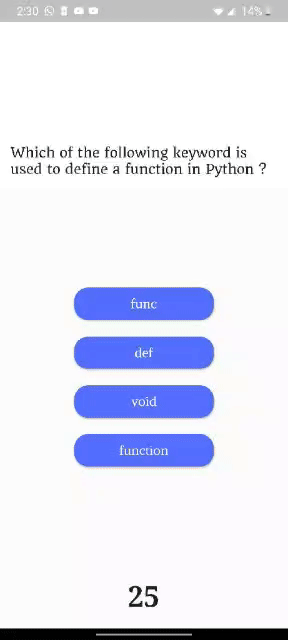

# Incept

This Flutter Project is an intuitive Quiz Application (especially for Python right now), which uses json API decoding to further parse data effortlessly to the application and works as a basis for the Quiz App Questions, where UI and Navigation is fairly Simple and coherent in flow, And further integration on custom-made TF lite model with flutter App is in the progress.




## Getting Started

These instructions will get you a copy of the project up and running on your local machine for development and testing purposes.

### Prerequisites

What things you need to install the software and how to install them

Download Flutter sdk from flutter.dev.
Copy the sdk to C:\src\flutter
Launch flutter_console

```
flutter doctor
```

This command would give you a clear interpretation of remaining tasks to be completed for flutter to operate successfully.

### Installing
If you are new to app dev, use Android Studio to install Android SDK effortlessly by installing it.

Now, Download VS Code and install it.
(You can also use Android Studio if you prefer that)

After installing, install Dart and Flutter extensions from extension store.

Now, Connect the respective device to your laptop i.e.
* iOS Device for Mac
* Android Device for Windows

Now, We can Start a project by simple Command
```
Ctrl+Shift+P
```

And to run any Flutter Project.
Go to Terminal Console

```
flutter run
```

End with an example of getting some data out of the system or using it for a little demo

## Built With

* [Flutter](https://flutter.dev/) - The Cross Platform framework used for App & Web Development
* [Tensorflow lite](https://www.tensorflow.org/lite) - TensorFlow Lite is an open source deep learning framework for on-device inference.
* [Google Cloud Functions](https://rometools.github.io/rome/) - It is Google Cloud's event-driven serverless compute platform

## Authors

* **Arpit Shrotriya** - *Initial work* - [Cyclostone](https://github.com/Cyclostone)

## Acknowledgments

* Hat tip to anyone whose code was used
* Inspiration
* etc
